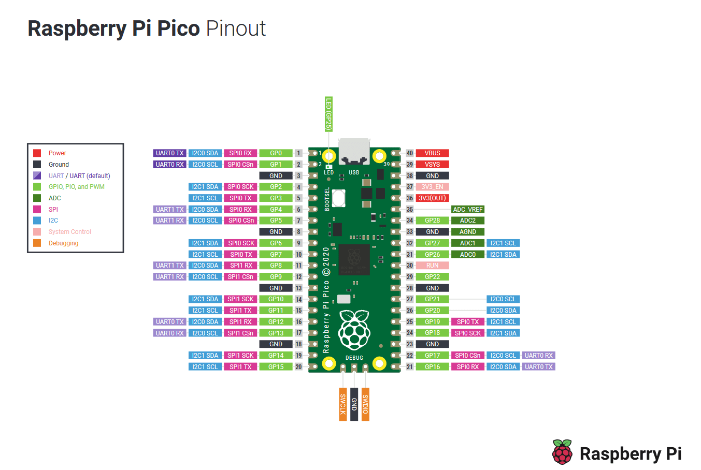
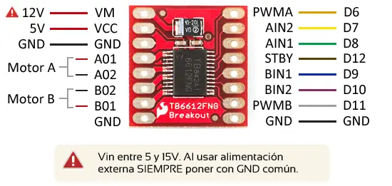
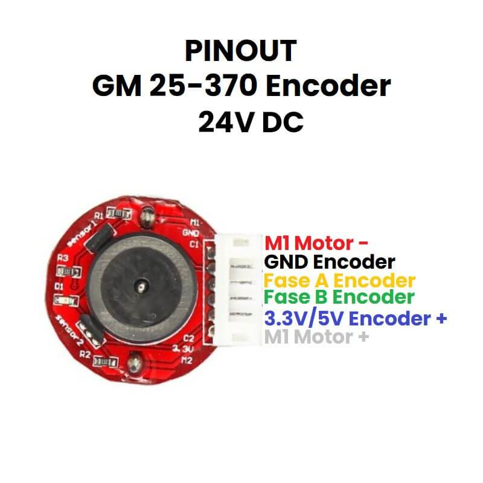

# Robot SCARA

## 📖 Descripción
Este proyecto implementa el control, el cálculo de trayectorias y otras funcionalidades clave para un robot SCARA. Incluye:
- Modelado cinemático y dinámico del robot.
- Control de juntas basado en PID.
- Generación de trayectorias.
- Integración con hardware (motores, encoders y sensores).
- Herramientas de simulación y visualización.

## Material de apoyo

### Links
- [Raspberry Pi Pico - MicroPython Environment](https://datasheets.raspberrypi.com/pico/raspberry-pi-pico-python-sdk.pdf)
- [MicroPython Docs](https://docs.micropython.org/en/latest/rp2/quickref.html)

### Tutoriales
- [Control PID Tutorial (motor encoder position)](https://www.youtube.com/watch?v=dTGITLnYAY0)